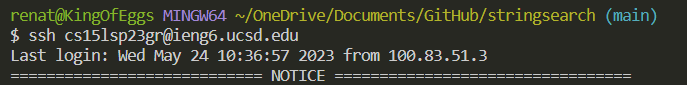
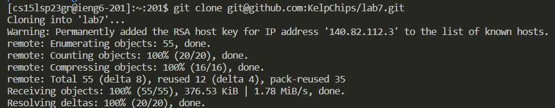
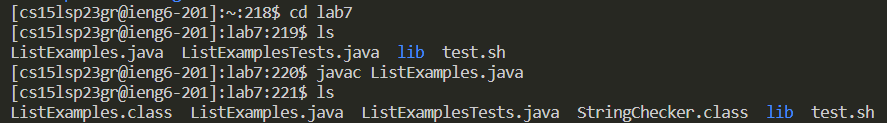
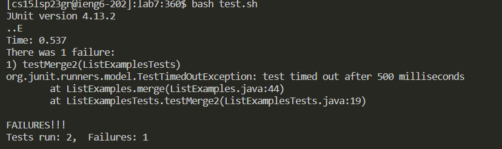
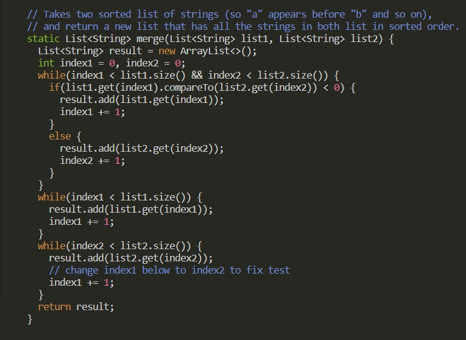
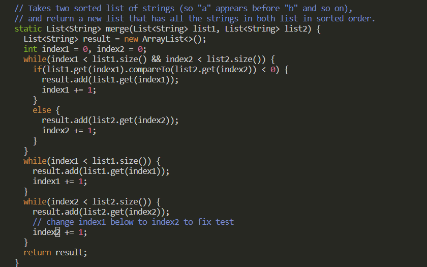
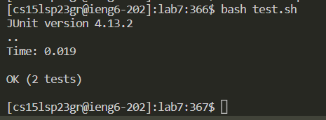
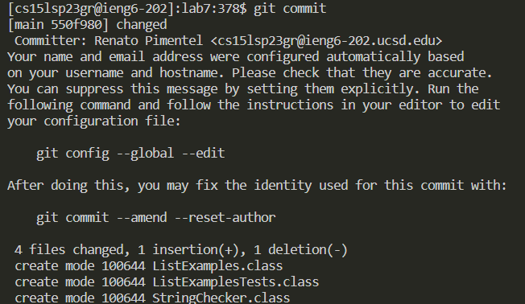
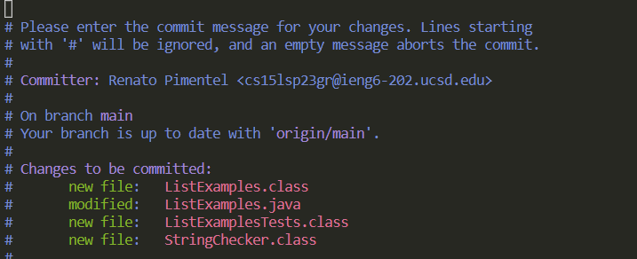
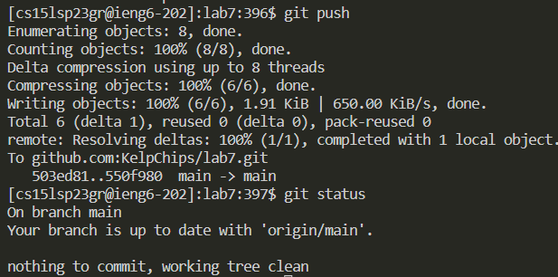

# Lab Report 4 | Using Vim - Renato Pimentel
## Step 1 | Logging into ieng6

Open your terminal in your coding software to bash, then proceed to log into your ieng6 acccount specific to your UCSD account.

## Step 2 | Clonning fork

Once you're logged into the ieng6 account, you'll type the command `git clone git@github.com:KelpChips/lab7.git`. The link to the repository from github will change dedpending on your account name, so just copy and paste from your github account forked repository.

## Step 3 | Run Test 

You will then change directories into the "lab7" folder. 

Then type `javac` ListExamples.java and type `bash tests.sh` into the terminal. This will run the `ListExamplesTests.java` file and will tell you that there are errors in the code. Showing you that there is 1 error.

## Step 4 | Edit code to fix errors

You will now be editing the `ListExamples.java` file in vim. So you type `vim ListExamples.java`, which will allow the user to edit the file directly from the command line.

*Before* 

From the error from step 3, we know we need to look at the merge command. So you will type `/merge` to go to that command and press `<Enter>`. We see that there is an error to fix for `index1`. To directly jump to that line of code we will type `/index1 +` and press `<Enter>`. This will jump to the first instance of this specific String, so get to the line to fix we will press `/` in conjuction with the `up` arrowkey to get what we type before and press `<Enter>`. Repeat this step one more time and you will be at the start of the line that we need to fix. You will then press `e` which should bring the cursor to the end of the line. Enter insert mode by pressing `i` and press the `right arrow key to place the cursor to the right of 1. Then hit `<backspace>` and type in `2`.
  
*After*

  
That will fix the eror, so now you will exit insert mode by pressing `ctrl+c` and type `:wq!` to save any changes to the file and exit.

## Step 5 | Run Tests again after fixing errors
  
After exiting you will run `bash test.sh` again and now you will see that you have no more errors
  

  
## Step 6 | Commit and Push changes to Github
  
To commit all your changes you will type `git add .`, which adds the current directory to the staging area. Then you will type `git commit` and will change the screen where you can type anything to give a commit message. press `i` and type whatever message that will be associated with the commit.

  
  
Then you will type `git push` which will push all the changes into your github account. To see if updated properly you can check your github account that you pushed the edits to.
  

